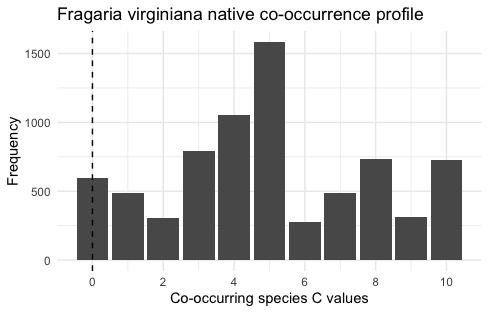

# Summary

Floristic Quality Assessment (FQA) is a standardized method for rating the ecological value of natural areas based on the plant species found within them [@spyreas2019floristic; @swink1994plants]. Each species known to be found in a particular region is assigned a *coefficient of conservatism*, C, on a scale of 0-10 by experts in local flora (non-native species are generally assigned a zero C-value by default). Larger values of C correspond to species that tend to be found in undegraded sites, while lower values indicate species that are more tolerant to human impacts [@bauer]. An inventory of the site is conducted and the average of the C-values found there is computed. This *native mean C-value*, sometimes weighted by the total number of plant species identified to give the so-called *floristic quality index* [@bowles2006testing], is frequently used by land managers and other agents to quantify an area's state of conservancy [@zinnen]. 

In recent years, it has become increasingly standard for practitioners to upload their floristic quality assessments to a central repository, [universalfqa.org](https://universalfqa.org/) [@freyman2016universal], which already includes tens of thousands of assessments from over one hundred floristic quality databases. This large public data cache represents a potentially invaluable resource for quantitative ecologists, though it has so far gone largely unexplored due to a lack of both technical tools for interacting programmatically with the repository and accessible workflows for analyzing the floristic quality data housed there. 

`fqar` is an R [@rcore] package which facilitates the analysis of occurrence and co-occurrence of plant taxa at the regional level. Pulling data on-demand from  [universalfqa.org](https://universalfqa.org/), it provides both organizational tools for handling the disparate sorts of data housed there and statistical ones for drawing novel conclusions from that data. 

# Statement of need

The [universalfqa.org](https://universalfqa.org/) website is calibrated for practitioners in the field rather than data analysts at their desks. It facilitates the recording, storing, and publicizing of individual floristic quality assessments and performs calculations of the statistical measures most often cited by land managers and conservation organizations in their reporting, including native mean-C. However, its focus on individual assessments is not well-suited to analyses that might wish to consider multiple assessments simultaneously.

This package compliments existing R packages for floristic quality analysis, including `fqacalc` and `fqadata`, which support the work of field practitioners wishing to make use of R [@fqacalc; @fqadata]. The `fqar` package enables analysis with a wider lens, allowing users to consider database-wide records of plant taxa or characteristics. By examining entire collections of assessments simultaneously, ecologists may gain insights into floristic quality assessment as well as the various plant species it tracks. Among the wide range of questions made answerable by `fqar` are the following:

- what is the co-occurrence profile of a given species of interest? What other plants (or types of plants) is it most frequently identified alongside?

- which species in a given database might be misclassified based on their co-occurrence profiles? It is to be expected that, on average, 9's and 10's will tend to be found among higher conservancy flora than 0's and 1's. Species that radically depart from this expectation would be candidates for re-evaluation. 

- what species are most commonly identified in certain regions? Which have been reported seldom or not at all?

- which non-native species have become widespread in particular regions? Which tend to be symptomatic of degraded areas, and which seem to be able to coexist alongside conservative native plants?

There is currently great need in the ecological community to validate and potentially refine the floristic quality assessment methodology [@spyreas2019floristic]. Because C-values, the metric on which FQA is ultimately based, are assigned based on the experience of small numbers of local experts, there are inevitable inconsistencies and irregularities which only a larger-scale reconsideration can address. Thus far the community has only been able to take preliminary or ad hoc steps in that direction [@matthews2015null; @bourdaghs2006properties]. The `fqar` package will allow for a more deep, targeted analysis.

# Typical workflow

Analysts using `fqar` will typically download and reformat assessments of interest before using functions like `assessment_cooccurrence_summary` to analyze the data. The following workflow does just this for the *Flora of the Chicago Region* database, an updated version of the original floristic quality manual [@wilhelm2017flora]. Depending on the needs of the specific user, such analysis can be restricted to particular practitioners, organizations, or locations, or redirected entirely along the lines described in the previous section.

First, download all public assessments in the desired database and reshape them into a standard format:

```r
library(fqar)
chicago_fqas <- download_assessment_list(database_id = 80)
chicago_invs <- assessment_list_inventory(chicago_fqas)
```

The output of the former command is a list of data frames in the original format provided by [universalfqa.org](https://universalfqa.org/). Each of these data frames includes several different sorts of information: species-level observations, summary statistics, and metadata. The second command isolates the species inventories and stores them in a tidy format [@JSSv059i10].  

Next, extract co-occurrence information from this collection of species inventories:

```r
chicago_cooccurrence <- assessment_cooccurrences(chicago_invs)
````

`fqar` provides tools for both quantitative and visual descriptions of the co-occurrence profile of given species. 

```r
species_profile(chicago_invs, 
                species = "Fragaria virginiana", 
                native = TRUE) # a data frame
species_profile_plot(chicago_invs, 
                     species = "Fragaria virginiana",
                     native = TRUE) # a visualization
```

{ width=75% }

Here we see that *Fragaria virginiana*, the wild strawberry, is listed with C $=0$ in the Chicago database but co-occurs with a wide variety of more conservative species. In particular, it has been found with 10's more frequently than it has with other 0's. 

Summary co-occurrence information for the entire database can be extracted with `assessment_cooccurrences_summary`, which gives a complete listing of all observed species and their co-occurring mean C-values.

```r
chicago_summary <- assessment_cooccurrences(chicago_invs)
```

The data generated by functions like these will be invaluable in the validation and refinement of floristic quality assessment.

# Availability

The `fqar` package is freely available via the Comprehensive R Archive Network (CRAN). 

`install.packages("fqar")`

Alternatively, the latest developmental version can be installed directly from GitHub:

`devtools::install_github("equitable-equations/fqar")`

Thorough documentation is provided. A long-form vignette gives a birds-eye overview of the package's functionality while help files for individual functions provide guidance on particular data analysis tasks. 

# Acknowledgements

Partial funding for this project was provided by the James Rocco Program. The authors also wish to thanks Glenn Adelson, Ph.D  (Lake Forest College) and Justin Thomas, M.Sc ([NatureCITE](https://www.naturecite.org/)) for their insight into floristic quality assessment. 

# References

