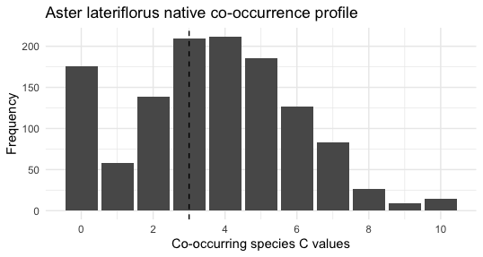
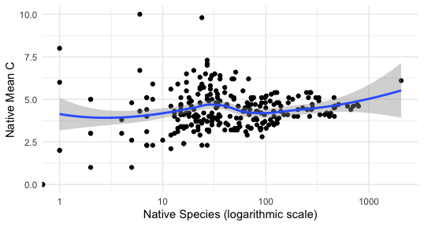

## Introduction

The `fqar` packages provides tools for downloading and analyzing floristic quality assessment (FQA) data from [universalFQA.org](https://universalfqa.org/). Two sample data sets, `chicago` and  `missouri`, are also provided.

Functions in this package fall into four general categories: _indexing functions_, which produce data frames of current public databases and FQAs from various regions, _downloading functions_, which download the FQAs themselves, _tidying functions_, which convert downloaded assessments into a standard format, and _analytic functions_, which compare species across assessments.

## Indexing functions

Each floristic quality assessment is tied to a specific databases of native plants that has been compiled by experts in local flora. A listing of all databases accepted by [universalFQA.org](https://universalfqa.org/) can be viewed with the `index_fqa_databases()` function.


```{r, eval = FALSE}
databases <- index_fqa_databases()
head(databases)
#> # A tibble: 6 × 4
#>   database_id region                                year description
#>         <dbl> <chr>                                <dbl> <chr>      
#> 1         206 "Allegheny Plateau, Glaciated"        2021 Faber-Lang…
#> 2          70 "Appalachian Mtn (EPA Ecoregions 66…  2013 Gianopulos…
#> 3         108 "Atlantic Coastal Pine Barrens (8.5…  2017 NEIWPCC FQ…
#> 4         136 "Atlantic Coastal Pine Barrens (8.5…  2018 NatureServ…
#> 5         204 "Atlantic Coastal Pine Barrens (8.5…  2021 Faber-Lang…
#> 6           1 "Chicago Region"                      1994 Swink, F. …
```

To see a listing of all public floristic quality assessments using a given database, use the `index_fqa_assessments()` function.


```{r, eval = FALSE}
missouri_fqas <- index_fqa_assessments(database_id = 63)
head(missouri_fqas)
#> # A tibble: 6 × 5
#>      id assessment                     date       site  practitioner
#>   <dbl> <chr>                          <date>     <chr> <chr>       
#> 1 30687 Bridge School Prairie Survey   2023-09-02 Vari… Nathan Aaron
#> 2 30115 Leatherwood Hollow Survey (Up… 2023-07-13 Pion… Nathan Aaro…
#> 3 29965 chi                            2023-06-28 CHI … chi         
#> 4 29949 CHI List                       2023-06-27 CHI … ns          
#> 5 29622 Interior Woodlands Survey      2023-05-26 WS I… Nathan Aaron
#> 6 29750 Wetland B                      2023-05-24 STL … Marion Well…
```

Similarly, the `index_fqa_transects()` function returns a listing of all public transect assessments using the specified database.  


```{r, eval = FALSE}
missouri_transects <- index_fqa_transects(database_id = 63)
head(missouri_transects)
#> # A tibble: 6 × 5
#>      id assessment        date       site               practitioner
#>   <dbl> <chr>             <date>     <chr>              <chr>       
#> 1  8434 Hawn-Array-2-2023 2023-09-04 Hawn State Park    Parks       
#> 2  8415 STJ-Array2-2023   2023-08-29 St. Joe State Park Parks       
#> 3  8414 STJ-3-23          2023-07-20 St. Joe State Park Parks       
#> 4  8347 TUCKER DNA        2023-07-06 DNA Floristic Sam… Lord/ Sutton
#> 5  8052 Golden DNA23      2023-06-28 DNA Floristic Sam… Lord/Sutton 
#> 6  8053 Lindens DNA23     2023-06-28 DNA Floristic Sam… Lord/Sutton
```

## Downloading functions

Floristic quality assessments can be downloaded individually by id number or in batches according to specified search criteria using the `download_assessment()` and `download_assessment_list()` functions, respectively. 

The first of these accepts an assessment ID number as its sole input and returns a data frame. For instance, the Grasshopper Hollow survey has `assessment_id = 25961` according to the listing obtained using `index_fqa_assessments()`. The following code downloads this assessment.


```{r, eval = FALSE}
grasshopper <- download_assessment(assessment_id = 25961)
```

Multiple assessments from a specified database can be downloaded simultaneously using `download_assessment_list()`, which makes use of `dplyr::filter` syntax on the variables `id, assessment, date, site` and `practitioner`. For instance, the following code downloads all assessments performed using the 2015 Missouri database at the Ambrose Farm site.


```{r, eval = FALSE}
ambrose <- download_assessment_list(database_id = 63,
                                    site == "Ambrose Farm")
```

For even mid-sized requests, this command may run slowly due to the limited speed of the [universalFQA.org](https://universalfqa.org/) website. For this reason, a progress bar has been added to the `download_assessment_list()` function when $n\ge 5$. 

As the name suggests, the output of `download_assessment_list()` is a list of data frames. 


```{r, eval = FALSE}
class(ambrose)
#> [1] "list"
length(ambrose)
#> [1] 3
```

Transect assessment data data stored on [universalFQA.org](https://universalfqa.org/) is accessible to analysts using the `fqar` package via the functions `download_transect()` and `download_transect_list()`, which work exactly like their counterparts, `download_assessment()` and `download_assessment_list()`.


```{r, eval = FALSE}
rock_garden <- download_transect(transect_id = 6875)
golden <- download_transect_list(database_id = 63,
                                 site == "Golden Prairie")
```

## Tidying functions

The data frames obtained from these downloading functions are all highly untidy, respecting the default structure of the website from which they are obtained. The `fqar` package provides tools for efficiently re-formatting these sets.

Each floristic quality assessments on [universalFQA.org](https://universalfqa.org/) includes two types of information: details about the species observed during data collection and summary information about the assessment as a whole. The ${\tt fqar}$ functions `assessment_inventory()` and `assessment_glance()` extract and tidy these two types of information.

For instance, the following code creates a data frame of species found in the 2021 Grasshopper Hollow survey downloaded earlier.


```{r, eval = FALSE}
grasshopper_species <- assessment_inventory(grasshopper)
glimpse(grasshopper_species)
#> Rows: 317
#> Columns: 9
#> $ scientific_name <chr> "Acer rubrum var. rubrum", "Acer saccharum…
#> $ family          <chr> "Sapindaceae", "Sapindaceae", "Asteraceae"…
#> $ acronym         <chr> "ACERUR", "ACESUG", "ACHMIL", "ACOCAL", "A…
#> $ nativity        <chr> "native", "native", "native", "non-native"…
#> $ c               <dbl> 5, 5, 1, 0, 8, 2, 5, 4, 4, 0, 2, 7, 6, 4, …
#> $ w               <dbl> 0, 3, 3, -5, 3, 3, -3, 5, 3, -3, 3, -5, 3,…
#> $ physiognomy     <chr> "tree", "tree", "forb", "forb", "forb", "f…
#> $ duration        <chr> "perennial", "perennial", "perennial", "pe…
#> $ common_name     <chr> "red maple", "sugar maple", "yarrow", "swe…
```

A tidy summary of the assessment can be obtained with `assessment_glance()`. The output is a data frame with a single row and 53 columns, including `native_mean_c`,  `native_species`, and `native_fqi`.


```{r, eval = FALSE}
grasshopper_summary <- assessment_glance(grasshopper)
names(grasshopper_summary)
#>  [1] "title"                     "date"                     
#>  [3] "site_name"                 "city"                     
#>  [5] "county"                    "state"                    
#>  [7] "country"                   "fqa_db_region"            
#>  [9] "fqa_db_publication_year"   "fqa_db_description"       
#> [11] "custom_fqa_db_name"        "custom_fqa_db_description"
#> [13] "practitioner"              "latitude"                 
#> [15] "longitude"                 "weather_notes"            
#> [17] "duration_notes"            "community_type_notes"     
#> [19] "other_notes"               "private_public"           
#> [21] "total_mean_c"              "native_mean_c"            
#> [23] "total_fqi"                 "native_fqi"               
#> [25] "adjusted_fqi"              "c_value_zero"             
#> [27] "c_value_low"               "c_value_mid"              
#> [29] "c_value_high"              "native_tree_mean_c"       
#> [31] "native_shrub_mean_c"       "native_herbaceous_mean_c" 
#> [33] "total_species"             "native_species"           
#> [35] "non_native_species"        "mean_wetness"             
#> [37] "native_mean_wetness"       "tree"                     
#> [39] "shrub"                     "vine"                     
#> [41] "forb"                      "grass"                    
#> [43] "sedge"                     "rush"                     
#> [45] "fern"                      "bryophyte"                
#> [47] "annual"                    "perennial"                
#> [49] "biennial"                  "native_annual"            
#> [51] "native_perennial"          "native_biennial"
```

The tidy format provided by `assessment_glance()` is most useful when applied to multiple data sets at once, for instance in the situation where the analyst wants to consider statistics from many different assessments simultaneously. The `assessment_list_glance()` function provides a shortcut when those data frames are housed in a list like that returned by `download_assessment_list()`. For instance, the following code returns a data frame with 52 columns and 3 rows, one per assessment.


```{r, eval = FALSE}
ambrose_summary <- assessment_list_glance(ambrose)
```

The `fqar` package also provides functions for handling transect assessment data. `transect_inventory()`, `transect_glance()`, and `transect_list_glance()` work just like their counterparts, `assessment_inventory()`, `assessment_glance()`, and `assessment_list_glance()`.


```{r, eval = FALSE}
rock_garden_species <- transect_inventory(rock_garden)
rock_garden_summary <- transect_glance(rock_garden)
golden_summary <- transect_list_glance(golden)
```

Additionally, transect assessments usually include physiognometric metrics like relative frequency and relative coverage. These can be extracted with the `trasect_phys()` function.


```{r, eval = FALSE}
rock_garden_phys <- transect_phys(rock_garden)
glimpse(rock_garden_phys)
#> Rows: 6
#> Columns: 6
#> $ physiognomy                       <chr> "Native forb", "Native g…
#> $ frequency                         <dbl> 115, 53, 20, 6, 4, 1
#> $ coverage                          <dbl> 628, 413, 180, 125, 78, 1
#> $ relative_frequency_percent        <dbl> 51.6, 23.8, 9.0, 2.7, 1.…
#> $ relative_coverage_percent         <dbl> 26.1, 17.2, 7.5, 5.2, 3.…
#> $ relative_importance_value_percent <dbl> 38.9, 20.5, 8.3, 4.0, 2.…
```

## Analytic functions

The `fqar` package provides tools for analyzing species co-occurrence across multiple floristic quality assessments. A typical workflow consists of downloading a list of assessments, extracting inventories from each, then enumerating and summarizing co-occurrences of species of interest.


```{r, eval = FALSE}
# Obtain a tidy data frame of all co-occurrences in the 1995 Southern Ontario database:
ontario <- download_assessment_list(database = 2)

# Extract inventories as a list:
ontario_invs <- assessment_list_inventory(ontario)

# Enumerate all co-occurrences in this database:
ontario_cooccurrences <- assessment_cooccurrences(ontario_invs)

# Summarize co-occurrences in this database, one row per target species:
ontario_cooccurrences <- assessment_cooccurrences_summary(ontario_invs)
```

Of particular note is the `species_profile()` function, which returns the frequency distribution of C-values of co-occurring species for a given target species. Users may specify the optional `native` argument to include only native species in the profile. The `species_profile_plot()` function takes identical arguments but returns an elegant plot instead of a data frame

For instance, _Aster lateriflorus_ (C=3) has the following native profile in the Southern Ontario database. 


```{r, eval = FALSE}
aster_profile <- species_profile("Aster lateriflorus", 
                                 ontario_invs,
                                 native = TRUE)
aster_profile
#> # A tibble: 11 × 4
#>    species            target_c cospecies_c cospecies_n
#>    <chr>                 <dbl>       <dbl>       <dbl>
#>  1 Aster lateriflorus        3           0         176
#>  2 Aster lateriflorus        3           1          58
#>  3 Aster lateriflorus        3           2         139
#>  4 Aster lateriflorus        3           3         209
#>  5 Aster lateriflorus        3           4         212
#>  6 Aster lateriflorus        3           5         186
#>  7 Aster lateriflorus        3           6         127
#>  8 Aster lateriflorus        3           7          83
#>  9 Aster lateriflorus        3           8          26
#> 10 Aster lateriflorus        3           9           9
#> 11 Aster lateriflorus        3          10          15

species_profile_plot("Aster lateriflorus", 
                     ontario_invs,
                     native = TRUE)
```



## Data sets

Two tidy data sets of floristic quality data, `chicago` and `missouri`, are included with the `fqar` package. Produced with `assessment_list_glance()`, these show summary information for every floristic quality assessment that used databases 63 and 149, respectively, prior to August 14, 2022. These sets may be useful for visualization or machine-learning purposes. For instance, one might consider the relationship between richness and native mean C in sites assessed using the 2015 Missouri database:


```{r, eval = FALSE}
ggplot(missouri, aes(x = native_species, 
                     y = native_mean_c)) +
  geom_point() +
  geom_smooth() +
  scale_x_continuous(trans = "log10") +
  labs(x = "Native Species (logarithmic scale)",
       y = "Native Mean C") +
  theme_minimal()
```



